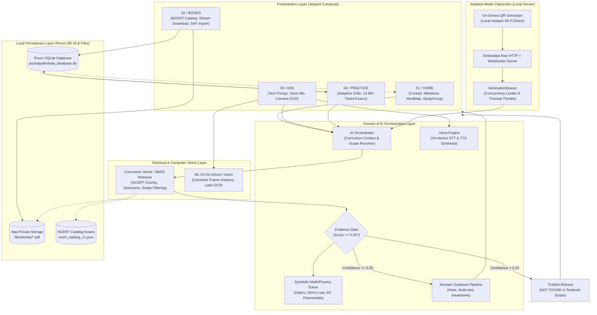
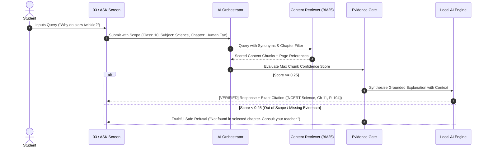
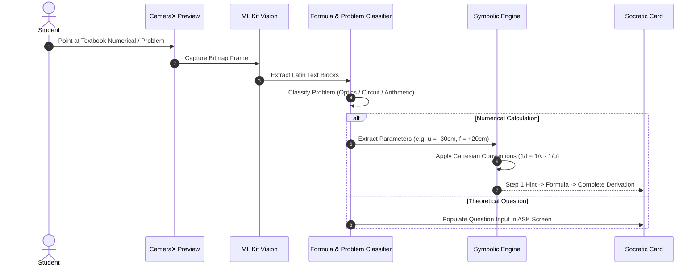
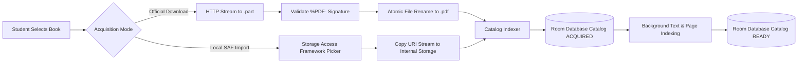
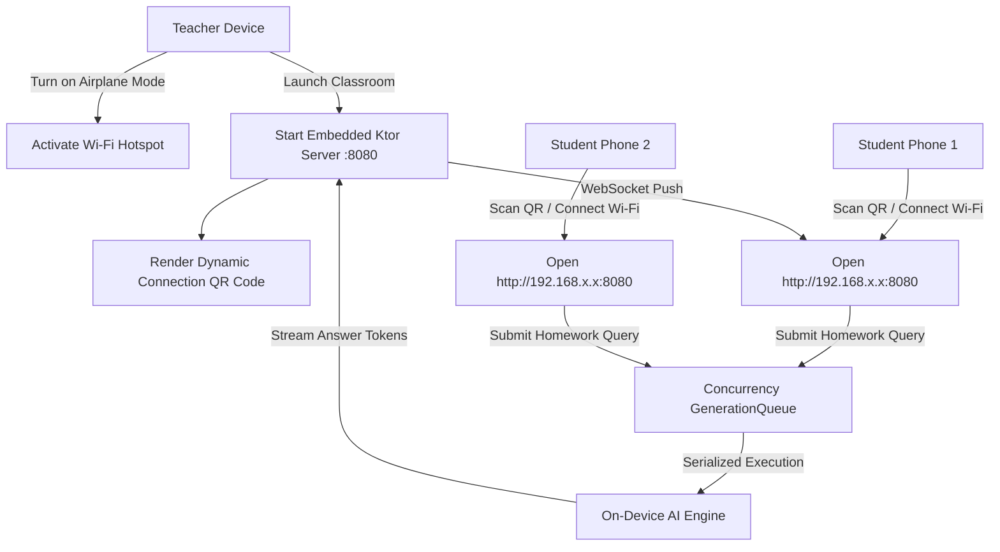

# PocketPathshala 📚⚡

> **"Your textbook. Your AI tutor. Your phone. Zero internet required."**

PocketPathshala is a fully offline, on-device AI learning companion engineered for NCERT curriculum students (Classes 6–10). Built with modern Android (Jetpack Compose, Kotlin Coroutines, Room DB, ML Kit, CameraX, and embedded Ktor), it transforms any standard smartphone into a zero-latency personal tutor and airplane-mode classroom hub without requiring cloud servers, user tracking, or an internet connection.

---

## 🏛️ System Architecture

PocketPathshala follows clean architecture principles with unidirectional data flow, strict separation of concerns, and defensive resource isolation to maintain battery life and thermal stability on mobile hardware.



---

## 🔄 Core Working Flows & Pipelines

### 1. Grounded Question Answering & The Evidence Gate

PocketPathshala prevents hallucinations by enforcing a strict **Evidence Gate**. An answer is never generated unless verifiable proof exists in the user's selected curriculum scope.



### 2. Camera OCR & Problem Solving Flow



### 3. Textbook Acquisition & Ingestion Pipeline



### 4. Airplane-Mode P2P Classroom Mesh

PocketPathshala allows a teacher's phone to act as an offline micro-cloud for an entire classroom:



---

## 📱 Feature Matrix & Screen Layout

The application utilizes a focused 4-tab Swiss editorial design with high contrast, precise typographic hierarchy, and zero redundant badges:

| Tab | Purpose | Capabilities |
| :--- | :--- | :--- |
| **`01 / HOME`** | **Daily Study Cockpit** | • Daily Streak and active syllabus tracking<br/>• **Active Study Excerpt**: Instant continuation of last studied topic<br/>• **Daily Milestone**: 71% syllabus mastery indicator<br/>• **Mind Map**: Interactive visual concept graph<br/>• **Study Group**: Local P2P Wi-Fi Direct mesh study launcher |
| **`02 / BOOKS`** | **NCERT Curriculum Hub** | • Catalog for Classes 6–10 (Science, Math, Social Science)<br/>• Direct official NCERT streaming download with integrity checks<br/>• Storage Access Framework (SAF) local PDF/Text import<br/>• Deletion, re-indexing, and storage footprint monitoring |
| **`03 / ASK`** | **Textbook-Grounded Tutor** | • Scoped query answering filtered by Class, Subject, Book, and Chapter<br/>• **Evidence Gate**: Strict rejection of out-of-scope queries<br/>• **Modalities**: Text chat, Voice microphone input, and Camera OCR scanning<br/>• Voice playback via on-device Text-to-Speech (English, Hindi, Odia) |
| **`04 / PRACTICE`** | **Adaptive Drills & Exams** | • Interactive multiple-choice chapter quizzes<br/>• Immediate pedagogical explanations for incorrect options<br/>• 10-Minute timed CBSE mock board examinations<br/>• Real-time mastery scoring and weak-concept detection |

---

## 🗄️ Database Architecture (Room v8)

All user progress, conversations, and downloaded materials are stored strictly in private SQLite storage (`pocketpathshala_database.db`):

| Table | Entity Class | Responsibility |
| :--- | :--- | :--- |
| `student_profile` | `StudentProfileEntity` | Local user name, grade/class level, preferred language, streak |
| `study_sessions` | `StudySessionEntity` | History of reading and interactive study sessions |
| `flashcards` | `FlashcardEntity` | Generated revision cards with Leitner spaced repetition |
| `concept_mastery` | `MasteryEntity` | Fine-grained mastery percentage per chapter concept |
| `quizzes` | `QuizEntity` | Quiz sessions generated for chapters or mock exams |
| `questions` | `QuestionEntity` | Question bank entries, options, correct answers, and hints |
| `quiz_attempts` | `AttemptEntity` | User quiz submissions and timestamped score histories |
| `scan_history` | `ScanEntity` | OCR scan logs, extracted queries, and solved step records |
| `ncert_catalog` | `CatalogItemEntity` | Metadata for curriculum books across Classes 6–10 |
| `catalog_acquisition`| `CatalogAcquisitionEntity` | Download progress, file paths, checksums, and indexing state |

---

## 🛡️ Privacy, Security & Offline Integrity

- **Zero Cloud Leakage**: No telemetry, analytics SDKs, crash trackers, or cloud dependencies.
- **Airplane-Mode Operability**: All capabilities (Search, Retrieval, Math Solver, OCR, Voice Engine, Classroom Host) function with radios disabled.
- **Copyright Compliant**: No copyrighted textbook PDFs are bundled inside the APK binary. Users stream official open NCERT resources or import their own study material.
- **Safe RAG Invariant**: High precision before recall. When textbook evidence is insufficient, PocketPathshala will explicitly report evidence unavailability rather than hallucinating facts.

---

## 🛠️ Build, Test & Development

### System Requirements
- **JDK**: Version 17+ (supports JDK 21 / 25 JVM target 24)
- **Android Studio**: Ladybug (2024.2.1+) or newer
- **Compile SDK**: API 37 (target SDK 35, minimum SDK 26 - Android 8.0 Oreo)
- **Build System**: Gradle 9.5.0 with Kotlin 2.1.0

### Command Reference

```bash
# 1. Run the entire unit test suite (73+ tests covering RAG, Solvers, DB, and UI)
./gradlew.bat testDebugUnitTest

# 2. Build the Debug APK package
./gradlew.bat assembleDebug

# 3. Stream install directly to connected Android device or emulator
./gradlew.bat installDebug

# 4. Start the application via ADB
adb shell am start -n com.dilshad.myapplication/.MainActivity
```

---

## 📄 License

This software is released under the **MIT License**. See [`LICENSE`](LICENSE) for complete terms.
